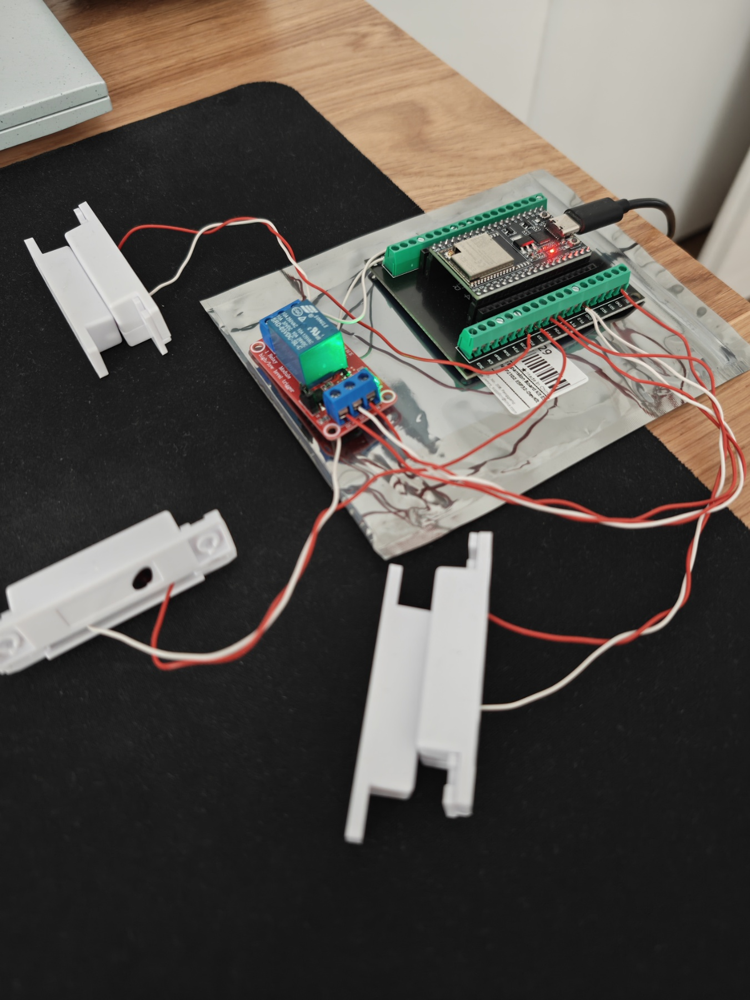
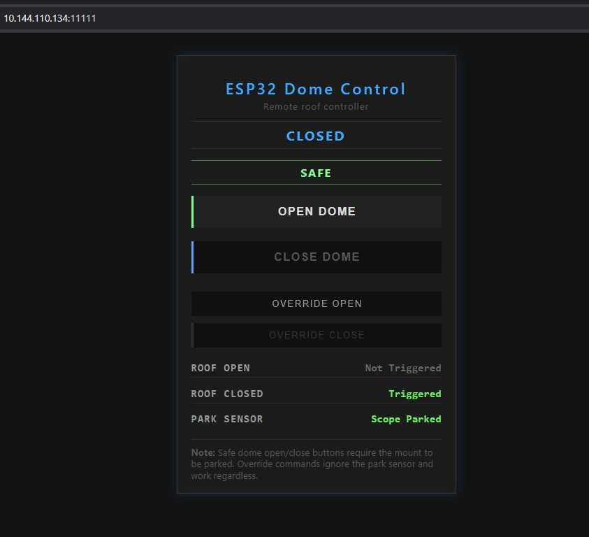
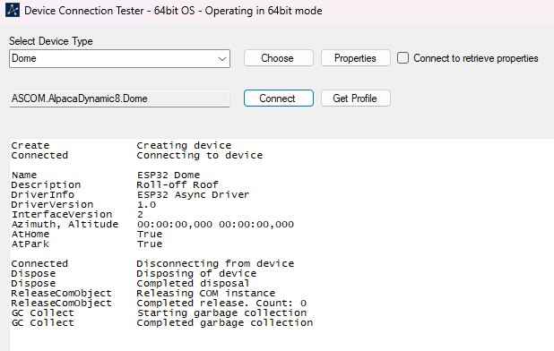
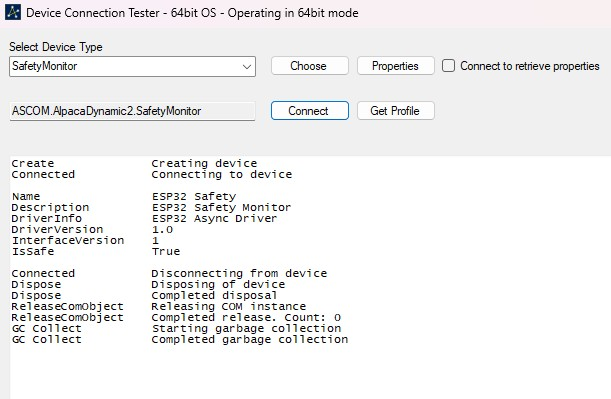

# ESP32 ASCOM Alpaca Dome (Roll-off Roof) & Safety Controller

A modern, wireless replacement for the classic Rolling Roof Computer Interface (RRCI),
built on a single ESP32 dev board and the ASCOM Alpaca standard. No Windows drivers,
no USB cables — just WiFi.

## Overview

This project upgrades the classic RRCI to the ASCOM Alpaca standard, replacing the
old USB-tethered Arduino solution with a completely wireless, OS-independent system
for roll-off roof control. A single relay drives the roof motor (open/close), and
magnetic reed switches report roof and mount park status.

The controller presents itself to your astronomy software (NINA, Voyager, SGP) as
two distinct Alpaca devices:

- **Dome Device** — Handles roof movement (Open/Close)
- **Safety Monitor** — Exposes the physical "Mount Parked" sensor state

> **Important:** Dome Alpaca endpoints (Open/Close) do **not** enforce the park
> sensor and behave like a classic RRCI controller.
>
> The Safety Monitor device exposes the park sensor state. Users who want interlocks
> should configure their automation software (e.g. NINA "Safety Monitor") to require
> this device to be **safe** before issuing dome commands.
>
> If you want to block roof movement when the mount is not parked, you **must** use
> the Safety Monitor driver in your astronomy software.

---

## Features

- **Alpaca Native** — No Windows ASCOM Platform required. Works on Linux (INDI),
  macOS, and Windows purely over WiFi
- **Integrated Safety** — Physical "Mount Parked" reed switch acts as a hardware
  interlock; automation software can reject commands if the mount is not parked
- **Dual Interface**
  - ASCOM/Alpaca REST API for automated imaging sessions
  - Mobile-friendly Web Dashboard hosted on the device (port 11111)
- **Manual Override** — Web UI includes override buttons to force roof movement
  during testing or emergencies, bypassing safety sensors
- **Low Cost** — Built for ~20€ using standard components from AliExpress

---

## Hardware Required (~20€)

| Component | Notes |
|---|---|
| ESP32 Development Board | Recommended: ESP32-WROOM-32U with external antenna for better range inside metal domes |
| ESP32 Expansion Board (38-pin) | For easy screw-terminal connections |
| 5V Relay Module (1-channel) | Triggers your existing roof motor controller |
| 3× Magnetic Reed Switches (NO) | Roof Open, Roof Closed, and Mount Parked detection |

---

## Pinout & Wiring

> All sensors use internal `INPUT_PULLUP`. Wire them to switch to **GND** when active.

| Function | GPIO | Wiring |
|---|---|---|
| Relay Trigger | GPIO 26 | Connect to Relay IN — triggers the roof motor |
| Roof Closed Sensor | GPIO 32 | Sensor between Pin 32 and GND |
| Roof Open Sensor | GPIO 33 | Sensor between Pin 33 and GND |
| Mount Safe Sensor | GPIO 27 | Sensor between Pin 27 and GND |

---

## Configuration

Open the sketch and locate the `// ========= USER SETTINGS =========` section.

- **CRITICAL:** Set `ssid` and `password` to match your observatory's WiFi network
- Default port: `11111`
- Static IP is not yet implemented in the sketch (see [TODO](#todo)); it is recommended
  to assign a static IP via your router's DHCP reservation using the ESP32's MAC address

---

## Required Libraries (Arduino IDE)

- `ESPAsyncWebServer`
- `AsyncTCP`
- Standard ESP32 WiFi libraries (included with ESP32 board support package)

---

## Connecting to NINA / ASCOM

Alpaca UDP discovery is disabled to conserve resources for the web server.
**You must add the device manually:**

### Dome Device

1. Open **ASCOM Diagnostics**
2. Go to **Device > Choose and Connect to Device**
3. Select **Dome** as Device Type → **Choose** → **Alpaca** → **Create Alpaca Driver**
4. Enter a name (e.g. `ESP32 Dome`) and click **OK**
5. Enter the ESP32's IP address and port `11111`
6. Click **OK**, then select your newly created device and click **Connect** to test

### Safety Monitor

Repeat the steps above, selecting **Safety Monitor** as the Device Type in step 3.

---

## Web Dashboard

Access `http://[YOUR_ESP32_IP]:11111` in any browser.

  

- **Standard Controls** — Respect the Mount Safe sensor state
- **Override Controls** — Bypass sensors (use with caution!)
- **Status Panel** — Real-time feedback for Roof Open, Roof Closed, and Park Sensor

---

## ⚠️ Safety Warning

**USE AT YOUR OWN RISK.**

Remote observatory control carries a real risk of equipment collision. The "Mount Safe"
sensor interlock depends entirely on correct physical sensor placement and wiring.
Always maintain a backup method (e.g. a physical power cutoff) to kill power to the
roof motor in the event of a software or network failure.

---

## TODO

- [ ] Static IP configuration option in the sketch (currently requires router-side
  DHCP reservation by MAC address)

---

## Contributing

Contributions are welcome! Feel free to open issues, submit pull requests, or suggest
improvements. Please keep code readable and comment any non-obvious logic.

---

## License

This project is licensed under the MIT License. See [LICENSE](LICENSE) for details.

## Author

**Robert Zibreg** — original author and maintainer.
